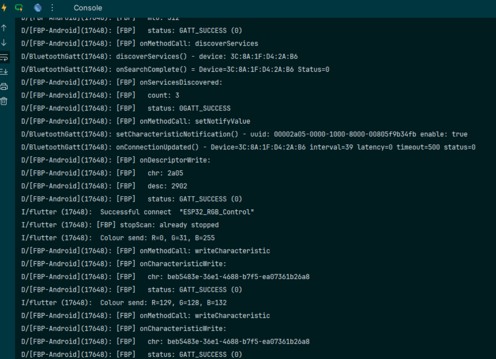
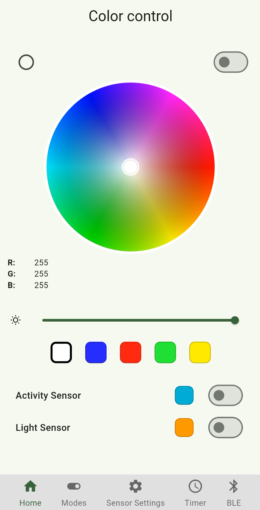
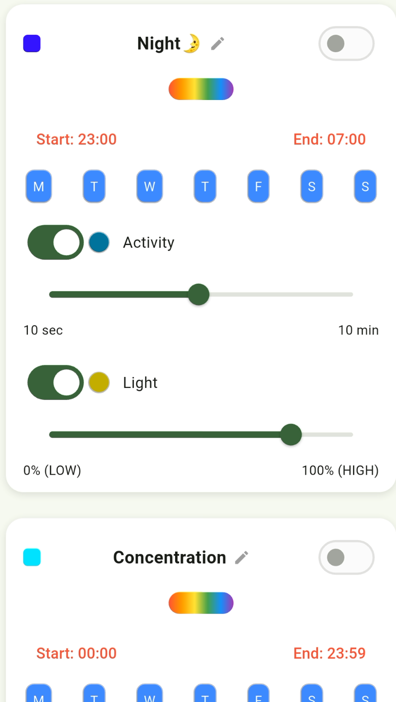
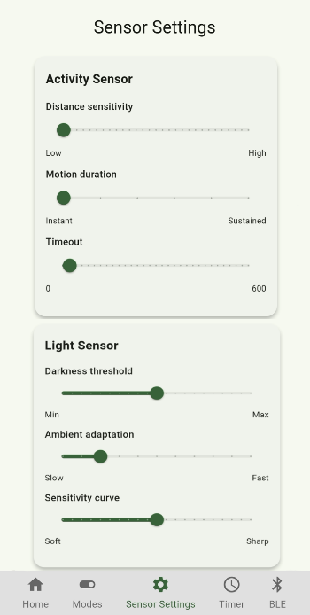
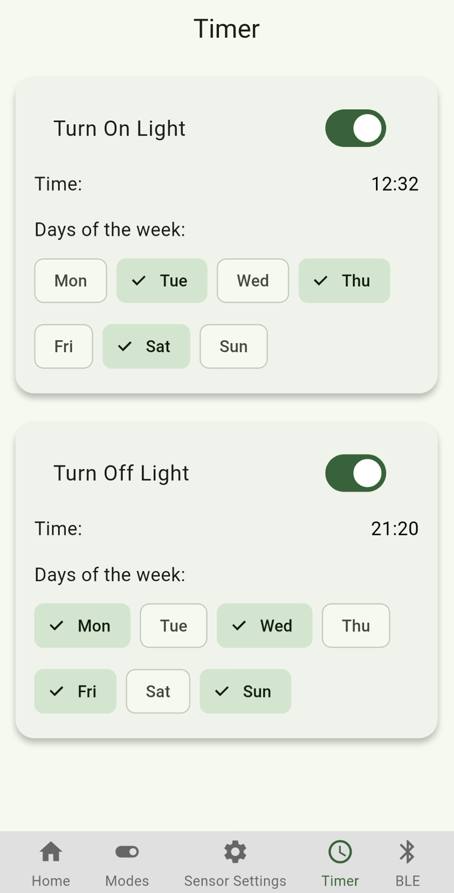
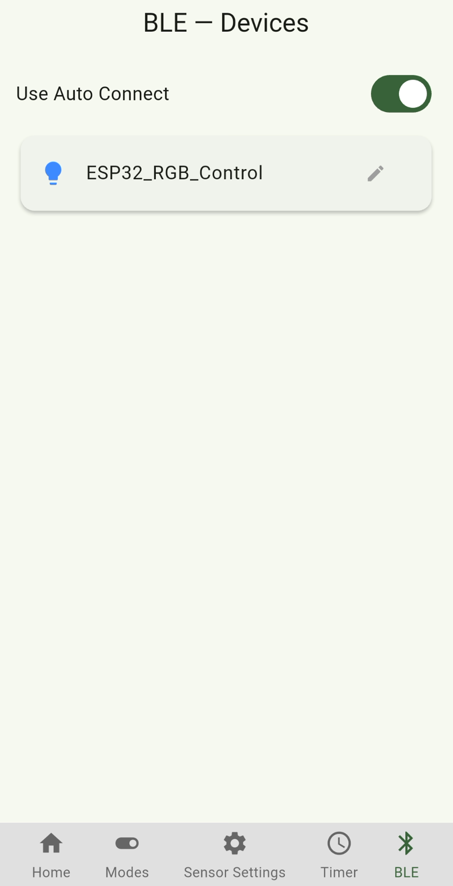

# LED BLE Controller

An end-to-end smart lighting system built as my bachelor's thesis: an ESP32
controls an RGB LED strip, and a Flutter mobile app talks to it over Bluetooth
Low Energy. I built all three layers myself, the firmware, the wireless protocol
between them, and the app.

## What it does

Control an RGB strip from your phone: pick a color, set brightness, save presets.
On top of that the system runs on its own using two sensors, and can follow a
weekly schedule:

- **Color control** over a color wheel, with quick-pick presets and a brightness slider.
- **Motion mode**: a PIR sensor triggers the light when someone enters the room.
- **Light mode**: a photoresistor switches the strip based on ambient brightness.
- **Timer**: turn the strip on and off at set times on chosen weekdays.
- Settings survive a power cut, they are stored on the ESP32 itself.

## How it is built

Three layers talk to each other like this:

```
┌─────────────┐   BLE    ┌──────────────┐   PWM    ┌──────────────┐
│ Flutter app │ ───────► │    ESP32     │ ───────► │  RGB strip   │
│  (phone)    │ ◄─────── │  (firmware)  │          │  + sensors   │
└─────────────┘  notify  └──────────────┘
```

The app sends commands over BLE. The ESP32 receives them, drives the LED strip
through PWM, reads the motion and light sensors, keeps time over NTP for the
scheduler, and shows status on a small OLED display.



## The BLE protocol

The app and the controller share a single BLE characteristic. Commands are told
apart by their length and a leading opcode byte, a small binary protocol I
designed for this project:

| Bytes           | Meaning                                    |
|-----------------|--------------------------------------------|
| `R G B`         | Set color (three raw bytes, no opcode)     |
| `0xA1` / `0xA0` | Motion mode on / off                       |
| `0xB1` / `0xB0` | Light sensor mode on / off                 |
| `0xF0` / `0xF1` | Timer on / off                             |
| `0xF2 H M`      | Set ON time (hour, minute)                 |
| `0xF3 H M`      | Set OFF time (hour, minute)                |
| `0xF4 mask`     | Set active weekdays (bitmask)              |

The controller notifies the app back with the current RGB values after each color change.

## The app

Built with Flutter (Dart). Five screens: color control, modes, sensor settings,
timer, and BLE device management. Last-used colors and modes are cached locally
so the app opens where you left off.

| Home | Modes | Sensors | Timer | Bluetooth |
|------|-------|---------|-------|-----------|
|  |  |  |  |  |

## Hardware

- **ESP32-WROOM-32** as the controller (chosen over Arduino Nano, ESP8266 and
  STM32 for its built-in BLE and Wi-Fi and enough PWM channels).
- **RGB LED strip (SMD 5050)** driven through a transistor stage on three PWM channels.
- **PIR sensor (HC-SR501)** for motion.
- **Photoresistor module** for ambient light.
- **SSD1306 OLED** for on-device status.

## Firmware

In `firmware/esp32_rgb_controller.ino`. Written for the Arduino framework. A few
things worth pointing out:

- The main loop never blocks: everything (BLE, sensors, timer) runs off `millis()`
  timing instead of `delay()`, so the controller stays responsive.
- Settings are saved to the ESP32's non-volatile storage (`Preferences`) and
  reloaded on boot.
- The timer uses NTP-synced time; this is the only reason Wi-Fi is needed. Put
  your own network into the `ssid` / `password` placeholders before flashing.
- Advertising restarts automatically when the phone disconnects.

## Running the app

```bash
flutter pub get
flutter run
```

Flash `firmware/esp32_rgb_controller.ino` to an ESP32 via the Arduino IDE, wire
it as shown in the diagram, and the app will find it as `ESP32_RGB_CONTROL`.

## Note

This started as my bachelor's thesis and is a working prototype, not a commercial
product. It shows an end-to-end system across firmware, a wireless protocol, and
a mobile app.